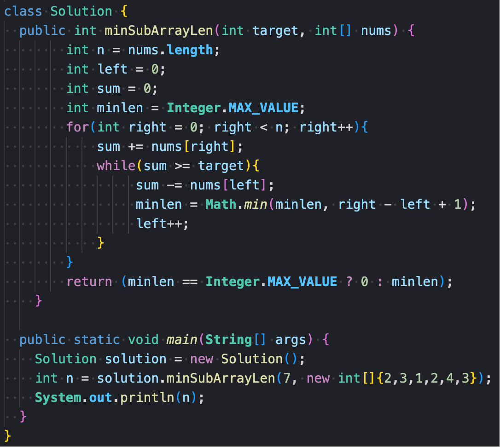
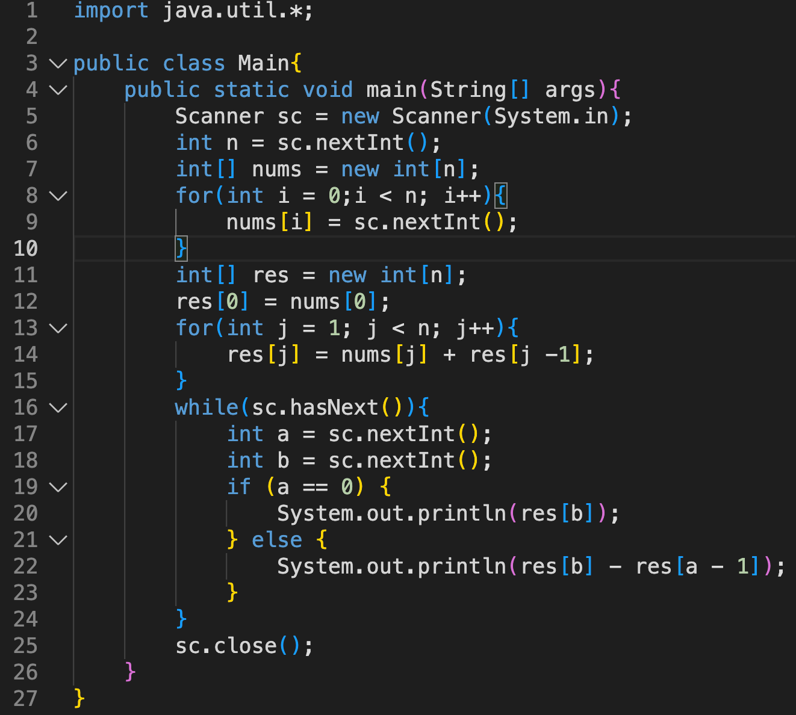
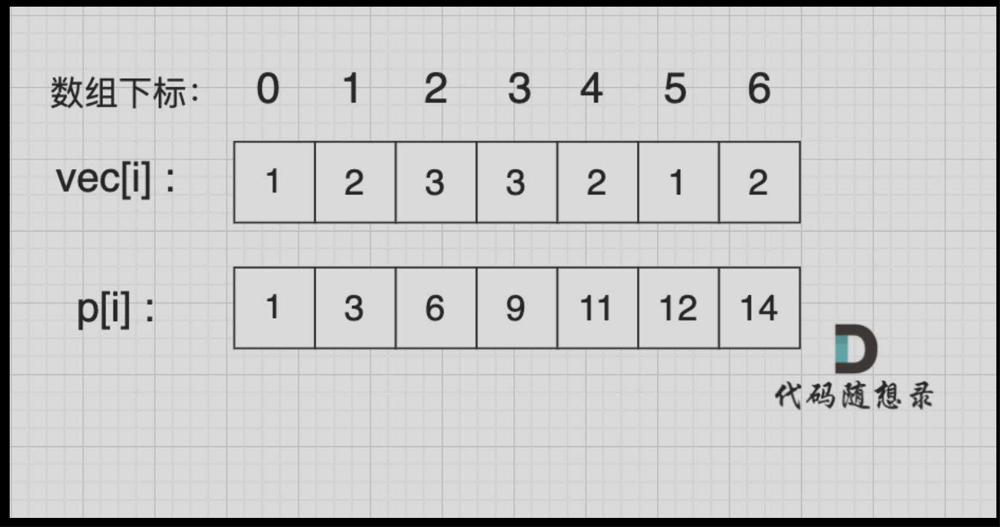
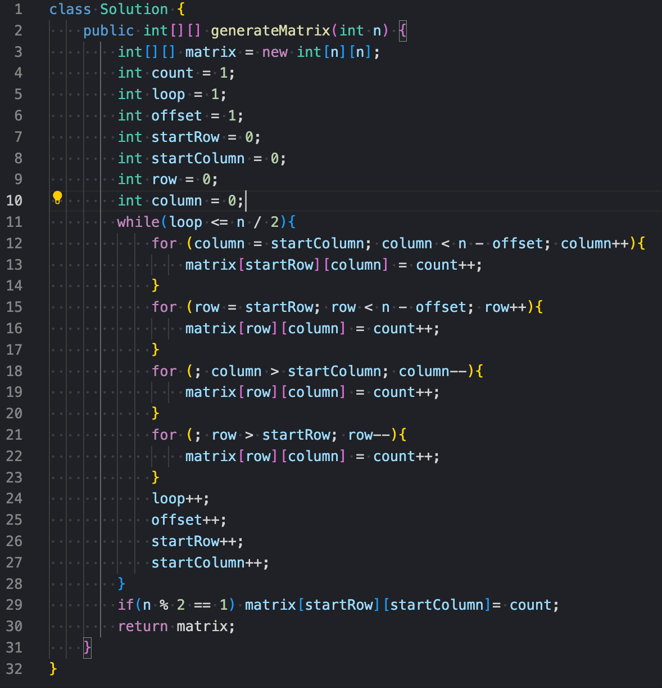
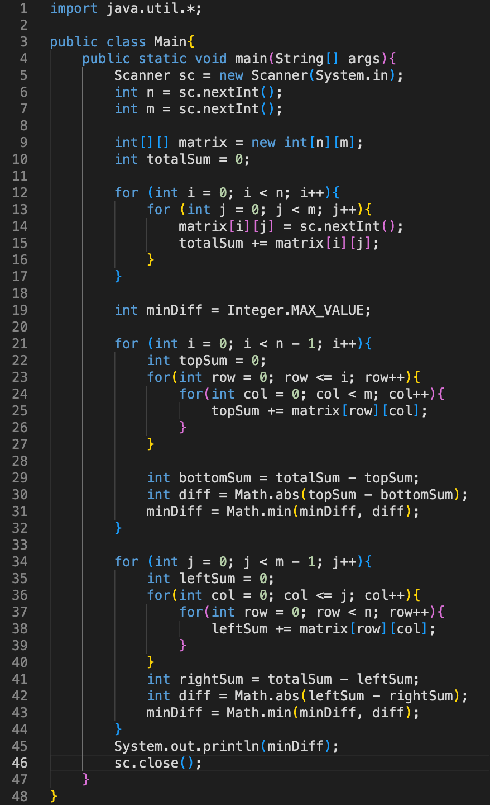

# Day 2 Notes

## 209. Minimum Size Subarray Sum

**题目链接**: LeetCode 209. Minimum Size Subarray Sum

**English**
Given an array of positive integers `nums` and a positive integer `target`, return the minimal length of a subarray whose sum is greater than or equal to `target`. If there is no such subarray, return 0 instead.

**中文**
给定一个含有正整数的数组 `nums` 和一个正整数 `target`，找出总和大于等于 `target` 的最短连续子数组的长度。如果不存在符合条件的子数组，返回 0。



> This question is about the sliding window technique and the two-pointer approach.
>
> I initialized the left pointer at index 0 and used the right pointer to iterate through the array. When the sum is greater than or equal to the target, I moved the left pointer step by step, subtracting the value at the current left index each time.

> Tip: I initialized `minLen` with `Integer.MAX_VALUE`, and before returning the result, I checked whether `minLen` was updated. It's important to update `minLen` before moving the left pointer.

> **Time Complexity**: O(n)  as we iterate through `nums` only once

> **Space Complexity**: O(1)  using only a few integer variables

------

## 58. 区间和（第九期模拟笔试）

**English**
 Given an integer array `Array`, calculate the sum of elements within each specified range.

**中文**
 给定一个整数数组 Array，请计算该数组在每个指定区间内元素的总和。



> This question is about the prefix sum technique.
>  First of all, I initialized two integer arrays: the original array and the prefix sum array.
>  I assigned the value at index 0 of the original array to index 0 of the prefix sum array.
>  Then I iterated through the original array and calculated the prefix sums by adding the current value to the previous prefix sum.
>  This gives us the complete prefix sum array.
>
> When we want to calculate the sum of elements between index `a` and `b`, we can simply use the prefix sum array: `prefix[b] - prefix[a - 1]`.
>
> Tips:
>
> 
>
>  
>
> ```
> p[1] = vec[0] + vec[1];
> p[5] = vec[0] + vec[1] + vec[2] + vec[3] + vec[4] + vec[5];
> p[5] - p[1] = vec[2] + vec[3] + vec[4] + vec[5];
> ```

> **Time Complexity**: O(n) preprocessing + O(1) per query

> **Space Complexity**: O(n) for auxiliary prefix sum array

------

## 59. 螺旋矩阵 II

**题目链接**: LeetCode 59. Spiral Matrix II

**English**
Given a positive integer `n`, generate an `n x n` matrix filled with elements from 1 to `n^2` in spiral order.

**中文**
给你一个正整数 `n`，生成一个包含 1 到 `n^2` 所有元素，且元素按顺时针螺旋顺序排列的 `n x n` 正方形矩阵。



> This problem is a bit abstract.
>  First, I initialized 8 variables: one 2D `int[][]` matrix and seven integer variables.
>  Then I used a `while` loop to fill in each element of the matrix.
>
> Here's a common trick: when filling an `n x n` matrix in layers, the number of loops is `n / 2`. So the condition for the `while` loop is `loop <= n / 2`.
>  I used a left-closed, right-open interval for the loop ranges.
>  After completing each loop, I updated `startRow`, `startColumn`, `loop`, and `offset`.
>
> After the `while` loop, if `n` is odd, I updated the center element at `matrix[startRow][startColumn]`.
>
> **Time Complexity**: O(n²) as we fill every element in the n×n matrix
>
> **Space Complexity**: O(1)  using only a few integer variables

------

## 44. 开发商购买土地（第五期模拟笔试）

**English**
 A rectangular city region is divided into `n * m` blocks, each block having a value representing the price of the land. Two developers, company A and company B, are planning to purchase the land.

All blocks must be split between A and B. Due to zoning restrictions, the entire region can only be split either horizontally or vertically into two parts, and each subregion must contain at least one block. Your task is to find a way to divide the region so that the **difference between the total land value** allocated to company A and company B is minimized.

**中文**
 在一个城市区域内，被划分成了 `n * m` 个连续的区块，每个区块都拥有不同的权值，代表其土地价值。目前，有两家开发公司 A 公司和 B 公司，希望购买这个城市区域的土地。

现在，需要将这个城市区域的所有区块分配给 A 公司和 B 公司。

然而，由于城市规划的限制，只允许将区域按横向或纵向划分成两个子区域，而且每个子区域都必须包含一个或多个区块。为了确保公平竞争，你需要找到一种分配方式，使得 A 公司和 B 公司各自的子区域内的土地总价值之差最小。

注意：区块不可再分。



> This question is also related to the prefix sum technique, but applied to a two-dimensional array.
>
> The goal is to split the entire matrix into two parts—either **horizontally** or **vertically**—and find the **minimum difference** between the total sums of the two regions.
>
> In the code, we first calculate the total sum of all elements in the matrix. Then, we try every possible horizontal split (by row) and vertical split (by column). For each split, we calculate the sum of one region, and subtract it from the total to get the sum of the other region. After that, we take the absolute difference and keep track of the minimum difference encountered.
>
> So essentially, although it's not using a traditional prefix sum array, the logic is similar—we're precomputing and subtracting to avoid recalculating.
>
> Overall, the problem itself is not very difficult, but the code is a bit long due to the nested loops and two directions to consider.
>
> **Time Complexity**: O(n * m)
>
> **Space Complexity**: O(n * m)