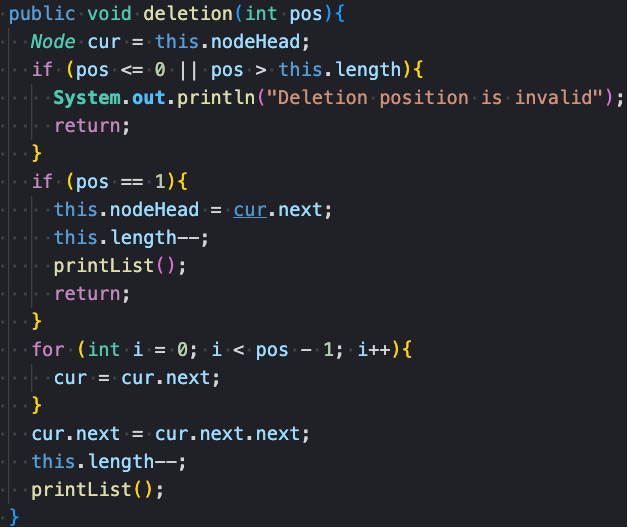

# Day 3 Notes

Basic theory of Linked List:

A linked list is a linear data structure where elements are connected using pointers.
Each node contains a value and a reference (or pointer) to the next node.
The pointer stores the address of the next node. For the last node, the pointer is `null`, indicating the end of the list.
The entry point of a linked list is called the `head` node.

In addition to singly linked lists, we also have doubly linked lists.
In a singly linked list, each node has only one pointer that points to the next node,
while in a doubly linked list, each node has two pointers: one to the next node and one to the previous node.
This allows traversal in both directions—forward and backward.

We also have circular linked lists.
A circular linked list is a list where the tail node is connected back to the head node, forming a loop.
This structure allows continuous traversal without reaching a null pointer.

So how is data stored in a linked list?
 We know that data in an array is stored in continuous memory locations, but this is not the case for a linked list.
 In a linked list, each node is stored separately in memory and connected by pointers.
 The nodes are not stored in continuous memory; instead, they are placed at arbitrary memory locations.
 The allocation policy is determined by the operating system's memory management.

For example, as shown in the diagram, the head node might contain the value 2 and the tail node 7. Each node is stored in a different memory location and linked through pointers.

So, how do we delete a node in a linked list?
We simply update the `next` pointer of the previous node to point to `next.next`, effectively skipping over the node to be deleted.

So, how do we insert a node into a singly linked list?
We let the previous node point to the new node, and then point the new node to the next node.
In other words, we update `prev.next = newNode`, and then `newNode.next = curr`.

Let’s compare the characteristics of arrays and linked lists.
 When we initialize an array, its length is fixed and cannot be changed. If we want to change its size, we have to create a new array and copy the existing elements.

In contrast, the size of a linked list is not fixed. It allows dynamic insertion and deletion of elements.
 Linked lists are commonly used when the amount of data is unpredictable or constantly changing.
 They are suitable for scenarios where frequent insertions and deletions are needed, but random access is not a priority.

------

## 203. Remove Linked List Elements

**题目链接**: [LeetCode 203. Remove Linked List Elements](https://leetcode.com/problems/remove-linked-list-elements/)

**English**
 Given the `head` of a linked list and an integer `val`, remove all the nodes of the linked list that have `val` as their value, and return the new head.

**中文**
 给你一个链表的头节点 `head` 和一个整数 `val`，请你删除链表中所有满足 `node.val == val` 的节点，并返回新的头节点。

> I initialized a dummy head node and set `dummy.next = head`. Then I used a `cur` pointer starting from the dummy head.
>
> I used a `while` loop to iterate through the linked list, checking `cur.next` at each step.
>  If `cur.next.val == val`, I updated `cur.next = cur.next.next` to remove the node.
>  Otherwise, I moved `cur` forward by setting `cur = cur.next`.
>
> Finally, I returned `dummy.next` as the new head of the list.

> **Time Complexity**: O(n)  Length of LinkedList

> **Space Complexity**: O(1)  dummyHead, cur

------

## 707. Design Linked List

**题目链接**: [LeetCode 707. Design Linked List](https://leetcode.com/problems/design-linked-list/)

**English**
 Design your implementation of a linked list. You can choose to use a singly or doubly linked list. A node in a singly linked list should have two attributes: `val` and `next`. Define a class to represent the linked list, and implement the following functions:

- `get(index)`
- `addAtHead(val)`
- `addAtTail(val)`
- `addAtIndex(index, val)`
- `deleteAtIndex(index)`

**中文**
 设计链表的实现。可以选择使用单向链表或双向链表。单链表中的节点应该有两个属性：`val` 和 `next`。实现一个类来表示链表，并实现以下功能：

- `get(index)`

- `addAtHead(val)`

- `addAtTail(val)`

- `addAtIndex(index, val)`

- `deleteAtIndex(index)`

  

  

  

  

  > This question is quite similar to standard linked list operations, but the implementation details are more structured. Instead of initializing the head to `null`, I designed this linked list using a **dummy head node**, initialized with a value of 0. The value of the dummy head doesn’t matter; it’s just a placeholder that simplifies edge case handling.
  >
  > For the `get` method, I first check whether the index is within bounds (i.e., `0 <= index < size`). If it's out of range, I return -1. Otherwise, I start from the dummy head and move the pointer `index + 1` times (since the dummy head is before the real head). Finally, I return the value at the target node.
  >
  > For `addAtHead`, I create a new node, set its `next` to `head.next`, and then set `head.next` to the new node. Don't forget to increment the size.
  >
  > For `addAtTail`, I create a new node and traverse the list from the dummy head to the last node using a `while` loop. Then I link the new node to the tail and increase the size.
  >
  > For `addAtIndex`, I first check if the index is valid (i.e., `0 <= index <= size`). If not, I return early. Otherwise, I move a pointer to the node before the target index, insert the new node, and adjust pointers accordingly. Note: if the index is equal to the size, this works like `addAtTail`; if index is 0, it’s the same as `addAtHead`.
  >
  > For `deleteAtIndex`, I check that the index is within range (i.e., `0 <= index < size`). If not, I return. Then I traverse to the node before the one to delete, skip it by reassigning `next`, and decrement the size. Since we're using a dummy head, deleting index 0 (the first real node) is easy and consistent. 

  > **Time Complexity**: O(n)  Length of LinkedList

  > **Space Complexity**: O(1)  dummyHead, cur

------

## 206. Reverse Linked List

**题目链接**: [LeetCode 206. Reverse Linked List](https://leetcode.com/problems/reverse-linked-list/)

**English**
 Given the `head` of a singly linked list, reverse the list, and return the reversed list.

**中文**
 给你单链表的头节点 `head`，请你反转链表，并返回反转后的链表头节点。

> This question can be solved using two approaches. The first one is the iterative two-pointer method.
>
> I initialized two pointers: `pre`, which initially points to `null`, and `cur`, which points to the `head` of the list.
>
> I used a `while` loop to iterate through the list. Inside the loop, I first stored the next node using a temporary variable `temp = cur.next`.
>
> Then I reversed the pointer by setting `cur.next = pre`. After that, I moved `pre` forward to `cur`, and moved `cur` forward to `temp`.
>
> When the loop ends, `pre` will be pointing to the new head of the reversed list, so I returned `pre`.

> **Time Complexity**: O(n)  Length of LinkedList

> **Space Complexity**: O(1)  dummyHead, cur

> Another approach is the classic recursive method. Personally, I find this a very helpful example to understand how recursion works.
>
> The base case is when `head == null` or `head.next == null`. In this case, we’ve reached the end of the list and simply return `head`, which becomes the new head of the reversed list.
>
> Before reaching the base case, we continue the recursion with `head.next` as the parameter. This keeps going until we reach the last node.
>
> After the recursion unwinds, for each stack frame, we perform the reversal:
>
> - Let’s say `head` is pointing to node 4, and we just returned from the recursive call for node 5.
> - We set `head.next.next = head` to reverse the link.
> - Then we set `head.next = null` to break the original forward link.
>
> This effectively makes node 5 point to node 4, and disconnects node 4 from node 5.
>
> By repeating this process as the recursion unwinds, we reverse the entire list step by step.
>
> Finally, the last node becomes the new head, which is returned up through each level of the recursion.

> **Time Complexity**: O(n)  

> **Space Complexity**: O(n) Stack Frame for each recursion  