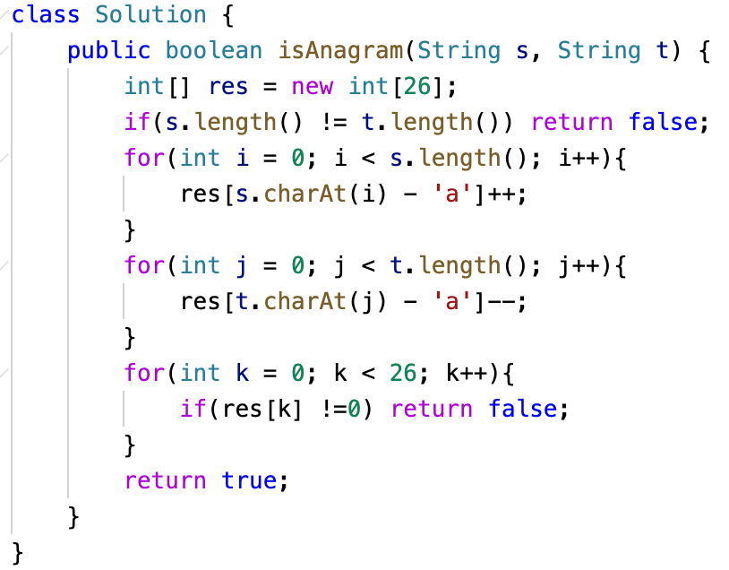
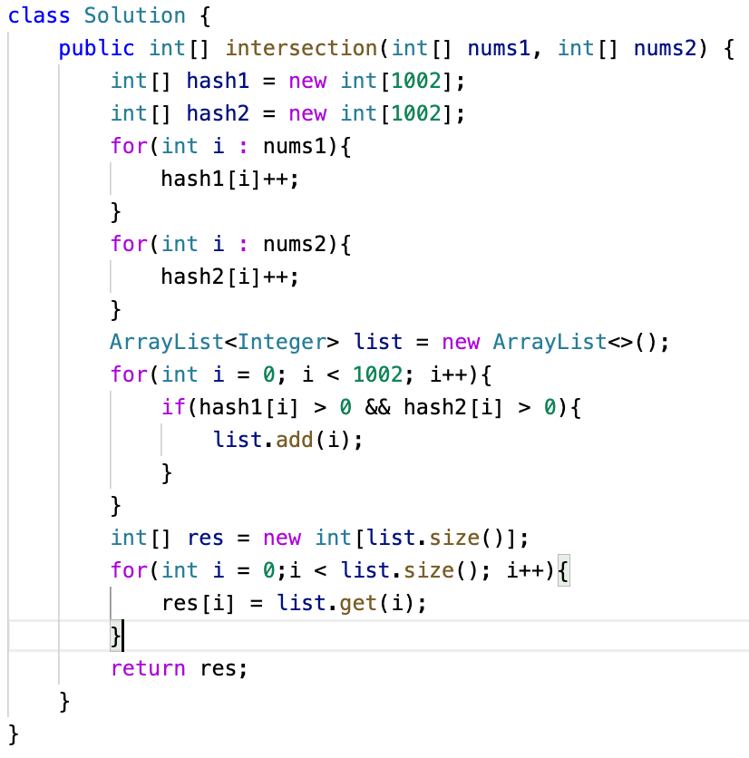
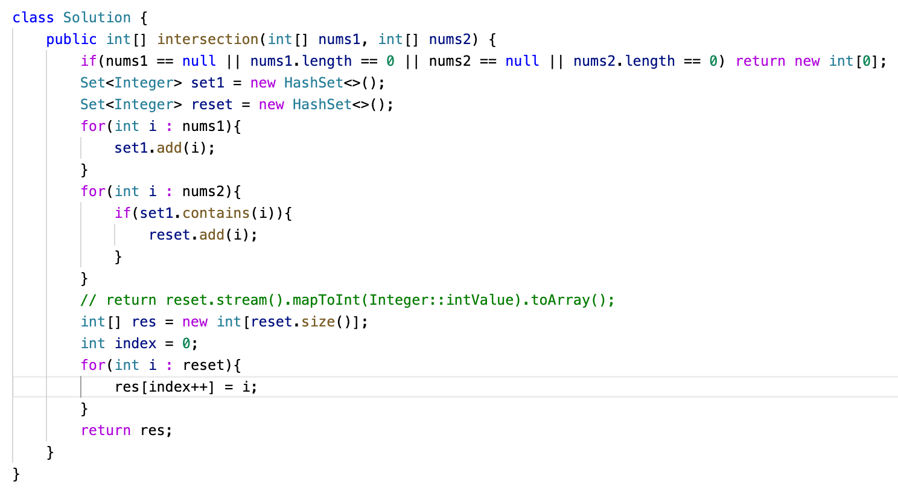
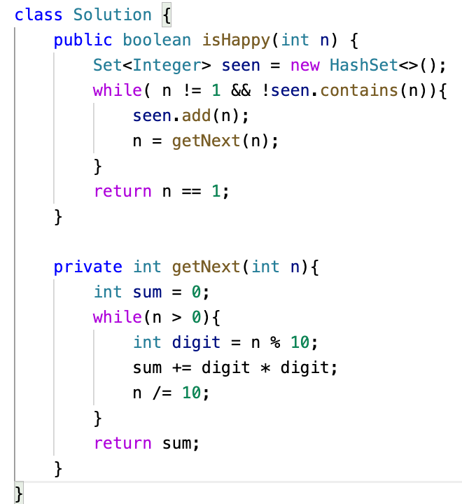
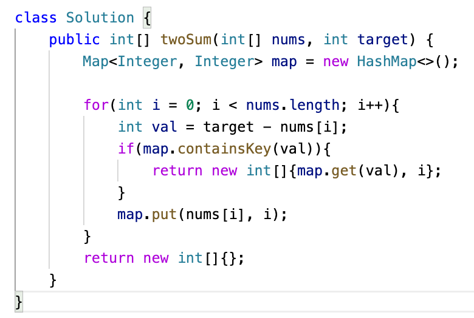

# Day 6 Notes

The basic theory of a hash table: actually, an array can be considered a simple hash table, where the **key** is the index. You can access elements directly using the index, as shown in the image below:

So, what kind of problems can a hash table solve?

Generally, a hash table is used to quickly check whether an element exists in a set.

For example, suppose you want to check if a student's name exists in a school database. If we use a hash table, the time complexity is **O(1)** — the lookup can be done in constant time.

First, we store all the student names in a hash table. Then, when querying, we simply check whether the name is present by accessing the corresponding index.

The process of converting a student’s name into an index in the hash table is done by a **hash function**.

A **hash function** maps a student's name to an index in the hash table.

When querying, we simply check whether the name exists by accessing the corresponding index.

The hash function is shown below. It generates a **hash code** that converts the name into a numeric value.

This hash code is calculated using a specific method, which can transform different types of data into unique values.

That way, we can map a student’s name into a specific index in the hash table.

When the hash code generated from a student's name is larger than the size of the hash table, we apply a **modulo operation** to ensure that the result stays within the bounds of the array.

This way, we guarantee that all student names can be mapped to valid indices within the hash table.

However, another problem arises: since a hash table is essentially an array, what happens if the number of students exceeds the size of the array?

In that case, even if the hash function distributes values as evenly as possible, **hash collisions** become unavoidable — meaning that multiple student names may map to the same index.

This situation is known as a **hash collision**, and we need specific strategies to handle it.

As shown in the diagram, both Xiao Li and Xiao Wang are mapped to index **1** in the hash table.
This phenomenon is called a **hash collision**.

There are generally two common ways to handle hash collisions: **chaining** and **linear probing**.

### 🔗 Chaining

In our previous example, both Xiao Li and Xiao Wang were mapped to index `1`, causing a collision.

With **chaining**, all elements that collide at the same index are stored in a **linked list** at that index.

This way, we can still access both Xiao Li and Xiao Wang by traversing the list at index `1`.

In fact, the efficiency of **chaining** depends heavily on choosing an appropriate `tableSize` (the size of the hash table) relative to the `dataSize` (the number of elements).

A good table size helps balance space and time:

- If the table is too large, many buckets will remain empty, wasting memory.
- If the table is too small, the linked lists at each index may become too long, increasing the time complexity of search operations.

Therefore, selecting a proper table size is critical to optimizing both **space usage** and **lookup efficiency** when using chaining.

### 📦 **Linear Probing**

When using **linear probing**, it’s essential that the `tableSize` is **larger than** the `dataSize`. This is because we rely on **empty slots** in the hash table to resolve collisions.

For example, if a collision occurs and Xiao Li is already placed at a certain index, we linearly **search forward** in the array to find the next available empty slot to store Xiao Wang.

Therefore, `tableSize` must be **greater than** `dataSize`, otherwise the hash table would not have any available space to accommodate the collided entries.

There are three commonly used hash table structures: **arrays**, **sets**, and **maps**.

### 🧠 Quick Memory Tip:

> **Array** → use when accessing by index
> **HashSet** → use when checking for existence
> **HashMap** → use when mapping key to value

## 242. Valid Anagram

**题目链接**: LeetCode 242. Valid Anagram

**English**
 Given two strings `s` and `t`, return `true` if `t` is an anagram of `s`, and `false` otherwise.

**中文**
 给定两个字符串 `s` 和 `t`，判断 `t` 是否是 `s` 的字母异位词（即包含相同的字母但顺序不同）。

> This is a classic example of using a hash table — or more specifically, a fixed-size array — to solve a problem.
>
> First, I initialize an array called `res` with a size of 26, representing the 26 lowercase English letters.
>
> Then I check a base case:
>  If `s.length` is not equal to `t.length`, we can immediately return `false` — they can't be anagrams.
>
> Next, I use a for loop to iterate through string `s`.
>  For each character, I increment `res[c - 'a']`, which maps the character to its index (like 'a' → 0, 'b' → 1, etc.) and counts its frequency.
>
> Then I loop through string `t`.
>  This time, for each character, I decrement `res[c - 'a']`.
>
> Finally, I go through the `res` array.
>  If any value is not zero, it means the two strings don’t have the same characters in the same counts, so I return `false`.
>  If all values are zero, I return `true`.

> **Time Complexity**: O(n + n + 26) = O(n)

> **Space Complexity**: O(1)  new int[26]

------

## 349. Intersection of Two Arrays

**题目链接**: LeetCode 349. Intersection of Two Arrays

**English**
 Given two integer arrays `nums1` and `nums2`, return an array of their intersection. Each element in the result must be unique and you may return the result in any order.

**中文**
 给定两个整数数组 `nums1` 和 `nums2`，返回它们的交集。返回结果中的每个元素必须是唯一的，结果可以按任意顺序返回。

> This problem, I believe, has two solutions. The first one uses arrays to simulate hash tables.
>
> First, I initialize two integer arrays, `hash1` and `hash2`, both of size 1002 (based on the problem's constraints).
>  I then iterate over both `nums1` and `nums2`, incrementing the corresponding index in each hash array.
>  This helps us count the frequency of each number in both input arrays.
>
> Next, I create an `ArrayList` to store the common elements.
>  I iterate through the entire range of indices in `hash1` and `hash2`.
>  If the value at the same index in both arrays is greater than zero, that means the number exists in both `nums1` and `nums2`, so I add that index to the list.
>
> After collecting all common elements, I initialize a result array `res` with a size equal to the size of the list.
>  Finally, I loop through the list and copy the elements into the `res` array, then return it.

> **Time Complexity**: O(n + m + 1002) = O(n + m)

> **Space Complexity**: min(n,m) → **O(min(n,m))**

> Another solution is to use **HashSet**.
>
> First, I check for edge cases: if either `nums1` or `nums2` is `null`, or if either array has a length of 0, I return an empty array immediately.
>
> Next, I initialize two sets:
>
> - `set1` to store the unique elements from `nums1`
> - `resSet` to store the intersection result
>
> I loop through `nums1` and add each unique element to `set1`.
>  Then I loop through `nums2` and check whether each element exists in `set1`.
>  If it does, I add it to `resSet`. This ensures the result only contains unique common elements.
>
> After collecting all the intersected values, I initialize an integer array `res` with a length equal to `resSet.size()`.
>  I then iterate through `resSet` and copy its elements into `res`, using an `index` pointer.
>  Finally, I return the `res` array.
>
> Tips: Set doesn't have get() method

> **Time Complexity**: O(n + m + K(length of reset)) = O(n + m)

> **Space Complexity**: O(n) + O(min(n,m)) + O(min(n,m)) = **O(n + min(n,m))**

------

## 202. Happy Number

**题目链接**: LeetCode 202. Happy Number

**English**
 Write an algorithm to determine if a number `n` is a happy number.
 A happy number is a number defined by the following process: Starting with any positive integer, replace the number by the sum of the squares of its digits, and repeat the process until the number equals `1` (where it will stay), or it loops endlessly in a cycle which does not include `1`. Those numbers for which this process ends in `1` are happy numbers.

**中文**
 编写一个算法来判断一个数 `n` 是否是快乐数。
 快乐数是：对一个正整数，每次用它每位数字的平方和来替代这个数，然后重复这个过程。如果最终能变成 1，则是快乐数；如果陷入无限循环且不会变成 1，则不是。

> To solve this problem, I first initialize a `Set` named `seen` to store all the numbers we've already encountered during the process. This helps us detect cycles — if a number appears again, we can conclude that it’s not a happy number.
>
> Before that, I define a helper function to calculate the **sum of the squares of each digit** in a number. This is done by:
>
> - Using a `while` loop to iterate through each digit.
> - Getting the last digit by taking `n % 10`.
> - Adding the square of that digit to a running sum.
> - Removing the last digit by dividing `n / 10`.
>
> This sum becomes the next number to evaluate.
>
> Back in the main function, I check two conditions inside a `while` loop:
>
> - If the number `n` becomes 1 → return `true` (it's a happy number).
> - If the number is already in the `seen` set → return `false` (cycle detected).
>
> Otherwise, I add `n` to the set, and call the helper function to get the next number. The process continues until one of the conditions is met.

> **Time Complexity**: O(log n)

> **Space Complexity**: O(log n)

------

## 1. Two Sum

**题目链接**: LeetCode 1. Two Sum

**English**
 Given an array of integers `nums` and an integer `target`, return indices of the two numbers such that they add up to `target`. You may assume that each input would have exactly one solution, and you may not use the same element twice. You can return the answer in any order.

**中文**
 给定一个整数数组 `nums` 和一个目标值 `target`，请你在数组中找出和为目标值的两个数，并返回它们的数组下标。每个输入只对应一个答案，你不能重复使用同一个元素。返回结果可以任意顺序。

> This is the very first problem on LeetCode and often seen as the beginning of the journey. It’s also a classic example of how to use a `HashMap`.
>
> **Approach:**
>
> - I initialize a `HashMap` to store numbers and their indices.
> - Then, I use a `for` loop to iterate over the array `nums`.
> - In each iteration, I calculate the value `val = target - nums[i]`.
> - I check if the `map` already contains `val` as a key.
>   - If it does, I immediately return a new array with the index of `val` from the map and the current index `i`.
>   - If it doesn’t, I add the current number `nums[i]` as a key and its index `i` as the value into the map.
> - If the loop finishes without returning, I return an empty array (or `null`).
>
> This problem demonstrates how a hash map helps achieve an efficient O(n) solution by trading space for time.

> **Time Complexity**: O(ln)

> **Space Complexity**: O(n)